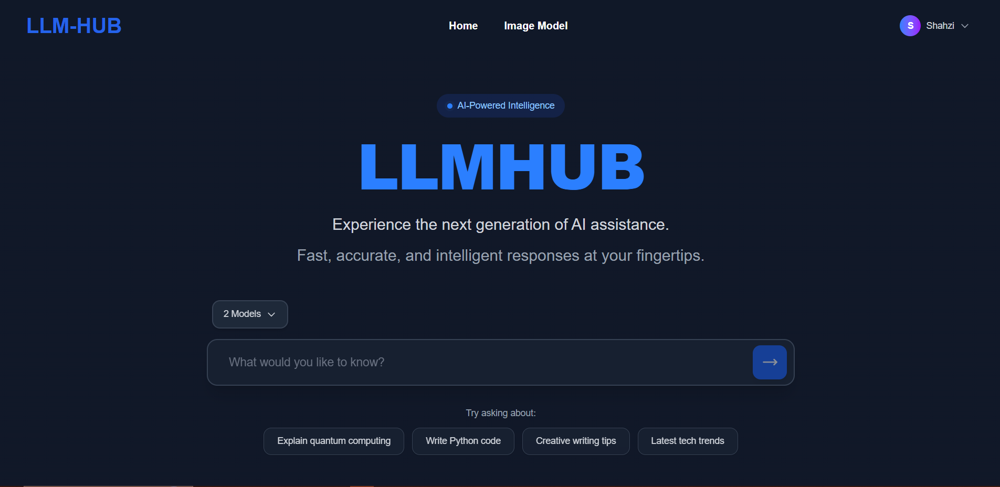

# LLMHUB - Enterprise AI Language Model & Image Generation Platform

## Executive Summary

**LLMHUB** is a sophisticated, production-ready web platform that aggregates multiple artificial intelligence language models and advanced image synthesis capabilities within a unified, user-centric interface. The platform enables seamless interaction with diverse LLM providers, facilitates real-time comparative analysis of model outputs, and provides state-of-the-art text-to-image generation functionality. This full-stack application demonstrates enterprise-grade architecture, comprehensive security implementation, and optimal user experience design principles.

---
## Visual Documentation

### Primary User Interface - Multi-Model Query Interface


---

## Core Capabilities

### Multi-Provider Language Model Integration
- Unified interface for accessing multiple generative AI models
- **Default Free Text Models (No Login Required):**
  - **NVIDIA Nemotron Nano** - Lightweight, fast LLM for general inquiries and analysis
  - **Deepseek ** - Advanced free model optimized for diverse language tasks
- **Premium Paid Model (Advanced Capabilities):**
  - **Gemini 3** via OpenRouter - Enterprise-grade reasoning and complex task handling
- Support for leading LLM providers including:
  - **OpenRouter Framework** - Comprehensive access to NVIDIA, Anthropic Claude, Mistral, and additional models
  - **Google Generative AI** - Native integration with Gemini family models
  - **Extensible Architecture** - Framework for custom LLM provider integration
- **Concurrent Model Querying** - Simultaneous invocation of multiple models with parallel response aggregation
- **Intelligent Model Selection** - Advanced filtering and comparative analysis capabilities
- **Real-time Response Streaming** - Asynchronous data flow with optimized rendering

### Advanced Image Synthesis
- **Authentication-Gated Feature** - Image generation requires user login and authentication
- Text-to-image generation powered by Flux diffusion models
- High-fidelity image synthesis via OpenRouter API integration
- Comprehensive asset management (download, regeneration, quality optimization)
- Progressive image rendering with responsive UI adaptation
- Error handling and fallback mechanisms for robust operation
- **Access Control** - Feature exclusively available to authenticated users ensuring quality resource allocation

### Authentication & Authorization
- Enterprise-grade authentication via Clerk identity platform
- Role-based access control and feature gating
- Comprehensive user session management
- Protected API routes with token-based authorization
- Account provisioning and profile management
- Secure logout and session termination protocols

### User Interface & Experience Design
- Modern, minimalist chat interface following industry best practices
- Full-responsive design supporting desktop, tablet, and mobile platforms
- Theme support including dark mode implementation
- Progressive loading indicators and real-time feedback mechanisms
- Accessible UI components with WCAG compliance considerations
- Optimized component performance with React.js best practices

### Navigation & Access Control
- Intelligent role-based feature visibility
- Protected routes for authenticated functionality
- Comprehensive account settings and preferences management
- Intuitive navigation architecture with mobile-optimized layouts
- Graceful degradation for unauthorized access attempts

---
## visual display of image generation feature


## Technology Stack & Architecture

### Frontend Architecture
- **Framework:** React 19 with TypeScript
  - Functional component architecture with React Hooks
  - Optimized rendering with memoization strategies
  - State management through Context API and local component state
- **Styling & Theming:** Tailwind CSS with customization
  - Utility-first CSS framework
  - Dark mode support with system preference detection
  - Responsive design breakpoints
- **Routing:** React Router v7
  - Declarative route configuration
  - Protected routes with authentication guards
  - Optimized code splitting
- **UI Components:** Shadcn UI + Custom Components
  - Accessible component library integration
  - Design system consistency
  - Performance-optimized interactions
- **Icon System:** Lucide React
  - Scalable vector graphics
  - Consistent design language
- **Authentication:** Clerk Identity Platform
  - OAuth integration
  - Session management
  - User profile management
- **Build & Optimization:** Vite
  - Rapid development server with HMR
  - Optimized production bundles
  - Tree-shaking and code splitting

### Backend Architecture
- **Runtime Environment:** Node.js 18+
- **Server Framework:** Express.js with TypeScript
  - RESTful API design patterns
  - Middleware-based request processing
  - Error handling and validation pipelines
- **API Integration Layer:**
  - OpenRouter API for multi-model LLM access
  - Google Generative AI SDK integration
  - Hugging Face Inference API connectivity
- **Environment Management:** dotenv
  - Secure credential management
  - Environment-specific configuration
  - API key handling protocols
- **Development Tools:**
  - TypeScript for type safety
  - ESLint for code quality
  - Prettier for code formatting

### Infrastructure Considerations
- Stateless API design for horizontal scalability
- RESTful endpoint architecture
- Asynchronous request handling
- Error resilience and retry mechanisms
- CORS configuration for cross-origin requests

- **Deployment & DevOps:** Environment variables management with secure credential handling

---

## Functional Architecture & Data Flow

### Language Model Query Processing
```
User Input Submission
    ↓
Model Selection & Validation
    ↓
Concurrent API Request Aggregation
    ↓
Parallel Model Invocation (OpenRouter/Gemini)
    ↓
Asynchronous Response Collection
    ↓
Real-time Response Display & Formatting
    ↓
Error Handling & User Feedback
```

### Image Generation Pipeline
```
Text Prompt Submission
    ↓
Prompt Validation & Normalization
    ↓
OpenRouter Flux API Invocation
    ↓
Image Synthesis Processing
    ↓
Image Asset Delivery & Caching
    ↓
Client-side Display & Optimization
    ↓
User Actions (Download/Regenerate)
```

### Authentication & Authorization Flow
```
User Credential Submission
    ↓
Clerk OAuth Processing
    ↓
Session Token Generation
    ↓
Role-based Access Control
    ↓
Protected Route Enforcement
    ↓
Feature Gate Application (Image Generation Unlock)
    ↓
Session Termination (Logout)
```

---

## Pricing Model & Access Tiers

### Free Tier (Public Access)
- **Text Response Generation** - Unlimited access to free LLM models
- **Available Models:**
  - NVIDIA Nemotron Nano - Fast, lightweight model for general inquiries
  - GLM (Zhipu) - Advanced multi-task language model
- **Features:**
  - Real-time parallel model responses
  - Model comparison and analysis
  - No authentication required
  - No usage limits
- **Limitations:**
  - Image generation disabled
  - Image Model link hidden/disabled in navigation

### Premium Tier (Authenticated Users)
- **Complete Feature Access** - All platform capabilities unlocked
- **Additional Models:**
  - Claude 3 (paid per token usage)
  - Full OpenRouter model catalog access
- **Features:**
  - Text response generation (all models)
  - **Image synthesis with Flux models** ✨ KEY PREMIUM FEATURE
  - Advanced model selection
  - Account settings and preferences
  - Usage analytics (planned)
- **Requirements:**
  - User login with Clerk authentication
  - Valid account credentials
  - Optional: API credits for premium models

### Revenue Model
- Freemium approach maximizing user acquisition
- Free tier drives engagement and platform awareness
- Premium features incentivize user authentication
- Image generation as key premium differentiator
- Flexible API pricing structure aligned with usage

---

## Project Organization & Codebase Structure

```
LLMHUB/
├── src/
│   ├── components/                 # Reusable React Components
│   │   ├── HeroSection.tsx         # Multi-model LLM interface component
│   │   ├── Imagegenerate.tsx       # Image synthesis module
│   │   ├── Llmresponse.tsx         # Response rendering component
│   │   ├── ModelSelector.tsx       # Model selection and filtering interface
│   │   ├── Navbar.tsx              # Navigation and authentication UI
│   │   ├── Login.tsx               # Authentication form
│   │   ├── Signup.tsx              # User registration form
│   │   ├── UserProfile.tsx         # User profile display
│   │   └── Accountsetting.tsx      # Account preferences and settings
│   ├── pages/                      # Page-level Components
│   │   ├── Home.tsx                # Landing and primary interface
│   │   └── About.tsx               # Application information page
│   ├── lib/
│   │   └── utils.ts                # Utility functions and helpers
│   ├── App.tsx                     # Root application component
│   ├── main.tsx                    # Application entry point
│   └── index.css                   # Global stylesheets
├── public/                         # Static assets and resources
├── Configuration Files
│   ├── tailwind.config.js          # Tailwind CSS configuration
│   ├── vite.config.ts              # Vite build configuration
│   ├── tsconfig.json               # TypeScript configuration
│   └── package.json                # Frontend dependencies

backend/
├── src/
│   ├── controller/                 # Business Logic Controllers
│   │   ├── llm.controller.ts       # LLM API integration and routing
│   │   └── image.controller.ts     # Image generation API handlers
│   ├── routes/                     # API Route Definitions
│   │   ├── LLMroutes.ts            # LLM endpoint specifications
│   │   └── imgaeroute.ts           # Image generation endpoints
│   ├── utils/
│   │   └── llmPrompt.ts            # System prompts and prompt engineering
│   ├── app.ts                      # Express application setup
│   └── index.ts                    # Server initialization and startup
└── Configuration Files
    ├── tsconfig.json               # TypeScript configuration
    └── package.json                # Backend dependencies
```

## Notable Implementations & Technical Achievements

✓ **Multi-Provider LLM Aggregation** - Seamless abstraction layer for diverse AI model providers with unified response formatting

✓ **Asynchronous Parallel Processing** - Concurrent API invocation with Promise.allSettled() for robust error handling across multiple models

✓ **Advanced Authentication Integration** - Enterprise-grade Clerk platform integration with role-based feature access control

✓ **Production-Grade UI Architecture** - Minimal, performance-optimized interface following accessibility standards and responsive design principles

✓ **Responsive Adaptive Design** - Mobile-first approach supporting desktop, tablet, and mobile platforms with optimized user experience

✓ **Comprehensive Error Handling** - Graceful degradation with user-friendly error messaging and fallback mechanisms

✓ **Secure API Integration** - Robust authentication, request validation, and environment-based credential management

✓ **Component Reusability** - Modular architecture enabling efficient code maintenance and feature expansion

---

## Deployment & Installation Guide

### System Requirements
- Node.js version 18 or higher
- npm or yarn package manager
- Modern web browser with JavaScript support
- Internet connectivity for external API integration

### Prerequisites & API Credentials
The following credentials are required for full platform functionality:
- **OpenRouter API Key** - Essential for LLM access and image synthesis
- **Clerk Authentication Keys** - Required for user authentication and session management
- **Google Generative AI Credentials** (optional) - For Gemini model integration

### Installation & Configuration

#### Frontend Setup
```bash
# Navigate to frontend directory
cd LLMHUB

# Install dependencies
npm install

# Start development server
npm run dev
```

#### Backend Setup
```bash
# Navigate to backend directory
cd backend

# Install dependencies
npm install

# Initialize environment configuration
# Create .env file with required API keys

# Start backend server
npm run dev
```

#### Environment Configuration Files

**Frontend Configuration (.env)**
```
VITE_API_URL=http://localhost:8000/api/v1/
VITE_CLERK_PUBLISHABLE_KEY=<your_clerk_publishable_key>
```

**Backend Configuration (.env)**
```
VITE_OPENROUTER_API_KEY=<your_openrouter_api_key>
VITE_HF_API_KEY=<your_huggingface_api_key>
NODE_ENV=development
```

---

## Platform Features & Capabilities - Detailed Specification

### Multi-Model Language Model Interface
- **Concurrent Model Selection** - Select and interact with multiple LLM providers simultaneously
- **Free Tier Access (Public):**
  - NVIDIA Nemotron Nano - General purpose language tasks
  - GLM (Zhipu) - Multi-task language understanding
- **Premium Tier (Paid Models):**
  - Claude 3 - Advanced reasoning and complex task handling
- **Real-time Response Aggregation** - Receive and display responses from all selected models in parallel
- **Provider Attribution** - Clear identification of response origin with pricing tier information
- **Error Isolation** - Individual model failures do not impact other model responses
- **Response Formatting** - Markdown rendering and syntax highlighting for code blocks
- **Model Comparison** - Side-by-side analysis of responses from different providers
- **Cost Transparency** - Display of pricing information for premium models

### Image Synthesis Module
- **Text Prompt Processing** - Natural language processing for image description parsing
- **Model Selection** - Integration with advanced diffusion models (Flux generation)
- **Quality Parameters** - Configurable image dimensions and quality settings
- **Asset Management** - Download functionality for generated images
- **Regeneration Capability** - Quick re-generation with prompt refinement
- **Error Recovery** - Graceful handling of generation failures with user-friendly messaging

### User Account Management
- **Authentication & Authorization** - Clerk-based OAuth integration with multi-factor support
- **Profile Management** - User information management and preference settings
- **Account Settings** - Granular control over privacy, notifications, and API integrations
- **Session Management** - Secure session handling with automatic timeout mechanisms
- **Account Security** - Password reset, session termination, and security controls

---

## Operational Considerations

### Scalability Architecture
- Stateless API design enabling horizontal scaling
- Asynchronous request processing supporting high concurrency
- Connection pooling for external API integration
- Response caching mechanisms for frequently requested data
- Load balancing readiness for multi-instance deployment

### Performance Optimization
- **Frontend:** Code splitting, lazy loading, component memoization
- **Backend:** Request batching, connection reuse, query optimization
- **Network:** Compressed payload delivery, efficient serialization
- **Rendering:** Virtual scrolling for large response lists, progressive enhancement

### Security Posture
- Environment-based credential isolation
- API request authentication and validation
- CORS configuration with origin whitelisting
- Rate limiting and DDoS protection readiness
- Secure session token management
- Input sanitization and output encoding
- HTTPS enforcement in production environments

---

## Future Development Roadmap

### Planned Enhancements
- [ ] Persistent conversation history with database integration
- [ ] Advanced model filtering with custom parameters
- [ ] Prompt template library and preset management
- [ ] Image post-processing and editing capabilities
- [ ] Comprehensive API usage analytics and monitoring
- [ ] Team collaboration and shared workspace features
- [ ] Custom model integration framework
- [ ] Public API endpoints for third-party integration
- [ ] Batch processing capabilities for bulk operations
- [ ] Export functionality (PDF, JSON, CSV formats)

### Infrastructure Improvements
- [ ] Database integration for data persistence
- [ ] Redis caching layer implementation
- [ ] WebSocket integration for real-time updates
- [ ] Containerization and Docker deployment
- [ ] CI/CD pipeline automation
- [ ] Comprehensive monitoring and logging infrastructure
- [ ] Performance analytics and optimization tracking

---

## Technical Documentation & Learning Resources

This project exemplifies several key software engineering principles and patterns:

**Frontend Development**
- React 19 best practices and performance optimization
- TypeScript for type-safe component development
- Custom hooks for state management abstraction
- Component composition and reusability patterns
- Responsive design implementation with Tailwind CSS

**Backend Development**
- RESTful API design and HTTP method semantics
- Express.js middleware architecture and request pipeline
- Asynchronous JavaScript patterns and Promise handling
- Third-party API integration strategies
- Error handling and graceful degradation patterns

**Full-Stack Integration**
- Client-server communication protocols
- Authentication and authorization patterns
- CORS configuration and cross-origin request handling
- Environment-based configuration management
- Production deployment considerations

---

## Support & Professional Engagement

For inquiries, collaboration opportunities, or technical discussion:

- **LinkedIn:** [Your Professional Profile]
- **GitHub Repository:** [Repository URL]
- **Email:** [Professional Email Address]

---

## Project Governance

**Version:** 1.0.0  
**Status:** Production-Ready  
**Last Updated:** December 25, 2025  
**License:** All Rights Reserved

---

*Enterprise-grade AI platform engineered for scalability, security, and seamless multi-model integration*## 📱 Features in Detail

### 1. **Multi-Model Selection**
- Choose from multiple LLM providers
- Compare responses in real-time
- Fast switching between models
- Clear response attribution

### 2. **Chat Interface**
- User messages appear on the right (blue bubble)
- AI responses appear on the left (light bubble)
- Clean, intuitive layout
- Smooth scrolling and animations

### 3. **Image Generation**
- Text-to-image conversion
- Flux model powered
- Small, compact image preview
- Quick download and regenerate buttons
- Error handling with user feedback

### 4. **User Account**
- Profile management
- Account settings
- Secure logout
- API key management for custom providers

---

## 🔐 Security Features

- Secure authentication with Clerk
- Protected API routes
- Environment variable management
- Error messages don't expose sensitive data
- CORS configuration for API safety

---

## 📊 Performance Metrics

- ⚡ Sub-second UI response time
- 🚀 Optimized bundle size with Vite
- 💨 Parallel API calls for faster results
- 🎯 Minimal re-renders with React optimization

---

## 🛣️ Roadmap

- [ ] Conversation history and persistence
- [ ] Advanced model filtering and sorting
- [ ] Prompt templates and presets
- [ ] Image editing capabilities
- [ ] API rate limiting and usage analytics
- [ ] Team collaboration features
- [ ] Custom model integration
- [ ] API endpoint for third-party developers

---

## 🤝 Contribution

This project is actively developed. Contributions are welcome!

---

## 📝 License

All rights reserved.

---

## 📧 Contact & Social

Share your feedback and connect:
- **LinkedIn:** [Your LinkedIn Profile]
- **Email:** your.email@example.com
- **GitHub:** [Your GitHub Profile]

---

## 🎓 Learning Resources

This project demonstrates:
- React 19 with TypeScript best practices
- Express.js backend development
- RESTful API integration
- Authentication implementation
- Responsive UI design
- Real-time data handling
- Error handling and validation

---

**Built with ❤️ to make AI accessible to everyone**

